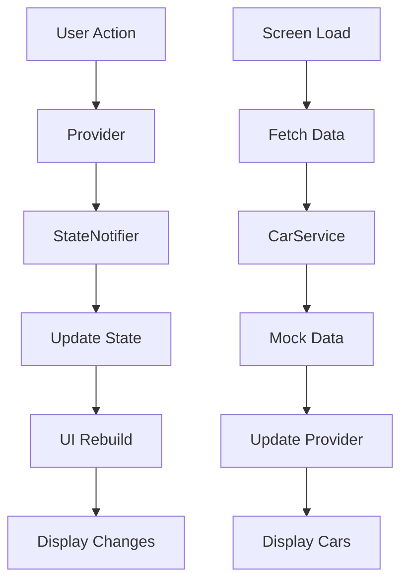

# 🚗 Car Rental Booking App - Flutter


---

## ✨ Features

### 🚘 Car Management
- Available cars with beautiful UI cards
- View comprehensive car details with specifications


### 📋 Booking System
- Complete booking form with date selection
- Price calculation based on rental duration
- Booking confirmation with detailed summary
- Mock booking system with local data

### 👤 User Authentication
- Mock login system (no backend required)
- Guest mode for quick access
- User session management

### 📱 Responsive Design
- Adaptive layout for all screen sizes
- Beautiful card designs with images
- Bottom navigation for easy access

---

## 🛠 Technical Highlights

### Core Packages

| Package | Purpose |
|:--------|:--------|
| `flutter_riverpod` | State management for the entire app |
| `go_router` | Declarative routing and navigation |
| `intl` | Date and time formatting |
| `cached_network_image` | Image caching and error handling |

### Architecture

```bash
📁 lib/
  ├── main.dart
  ├── app.dart
  ├── router.dart
  ├── models/
  │   ├── car_model.dart
  │   └── booking_model.dart
  ├── services/
  │   └── car_service.dart
  ├── providers/
  │   ├── auth_provider.dart
  │   ├── car_provider.dart
  │   └── booking_provider.dart
  ├── screens/
  │   ├── welcome_screen.dart
  │   ├── car_list_screen.dart
  │   ├── car_detail_screen.dart
  │   ├── booking_form_screen.dart
  │   └── booking_confirmation_screen.dart
  └── widgets/
      ├── car_card.dart
      ├── spec_item_card.dart
      └── shimmer_loader.dart
```

- **Data Layer**: Local mock data with CarService
- **State Management**: Riverpod with StateNotifierProvider
- **Navigation**: GoRouter for declarative routing
- **UI Components**: Reusable widgets with consistent design

---

## 🚀 Getting Started

### Prerequisites
- Flutter SDK (^3.32.8)
- Dart SDK (^3.8.1)
- Android Studio / VS Code / Xcode

### Installation

1. **Clone/download the project**

2. **Install dependencies**
   ```bash
   flutter pub get
   ```

3. **Run the app**
   ```bash
   flutter run
   ```

---

## 🎨 Screens Flow

### 1. Welcome/Login Screen
- Beautiful gradient background
- Mock login functionality
- Guest mode access
- Email: `user@example.com` | Password: `password`

### 2. Car List Screen
- Beautiful card design with car images
- Responsive grid layout


### 3. Car Detail Screen
- Full-screen car image
- Detailed specifications grid
- Features list with chips
- Bottom bar with price and booking button
- Smooth back navigation

### 4. Booking Form Screen
- Personal information form
- Date picker for rental period
- Location selection
- Price calculation preview
- Form validation

### 5. Booking Confirmation Screen
- Success confirmation
- Booking summary
- Options to browse more cars

---

## 🔄 State Management Flow




---

## 🎯 Key Design Decisions

### 1. **State Management with Riverpod**
- Used StateNotifierProvider for complex state
- Separate providers for auth, cars, and bookings
- Efficient rebuilds with Consumer widgets

### 2. **Navigation with GoRouter**
- Declarative routing configuration
- Path parameters for dynamic screens
- Proper back navigation handling


### 3. **Responsive UI Components**
- Adaptive grid layouts for different screen sizes
- Constrained heights to prevent overflow
- Consistent spacing and padding
- Beautiful card designs with shadows

### 4. **Error Handling**
- Network image error builders
- Empty state screens
- Loading states with shimmer effects
- Form validation with user feedback

---

## 📦 Folder Structure

```
lib/
├── main.dart                    # App entry point
├── app.dart                     # Main app widget
├── router.dart                  # GoRouter configuration
├── models/                      # Data models
│   ├── car_model.dart           # Car data structure
│   └── booking_model.dart       # Booking data structure
├── services/                    # Business logic
│   └── car_service.dart         # Mock car data service
├── providers/                   # State management
│   ├── auth_provider.dart       # Authentication state
│   ├── car_provider.dart        # Car list state
│   └── booking_provider.dart    # Booking state
├── screens/                     # App screens
│   ├── welcome_screen.dart      # Login screen
│   ├── car_list_screen.dart     # Car listing with search
│   ├── car_detail_screen.dart   # Car details with specs
│   ├── booking_form_screen.dart # Booking form
│   └── booking_confirmation_screen.dart # Confirmation
└── widgets/                     # Reusable components
    ├── car_card.dart            # Car list item card
    ├── spec_item_card.dart      # Specification card
    └── shimmer_loader.dart      # Loading skeleton
```

---

## 🔧 Configuration

### Environment Setup
1. Ensure Flutter is installed and configured
2. Run `flutter doctor` to check dependencies
3. Use VS Code or Android Studio with Flutter extensions

### Running the App
```bash
# Development mode
flutter run

# Build for production
flutter build apk --release
flutter build ios --release
```

### Testing
```bash
# Run tests
flutter test

# Run with coverage
flutter test --coverage
```
